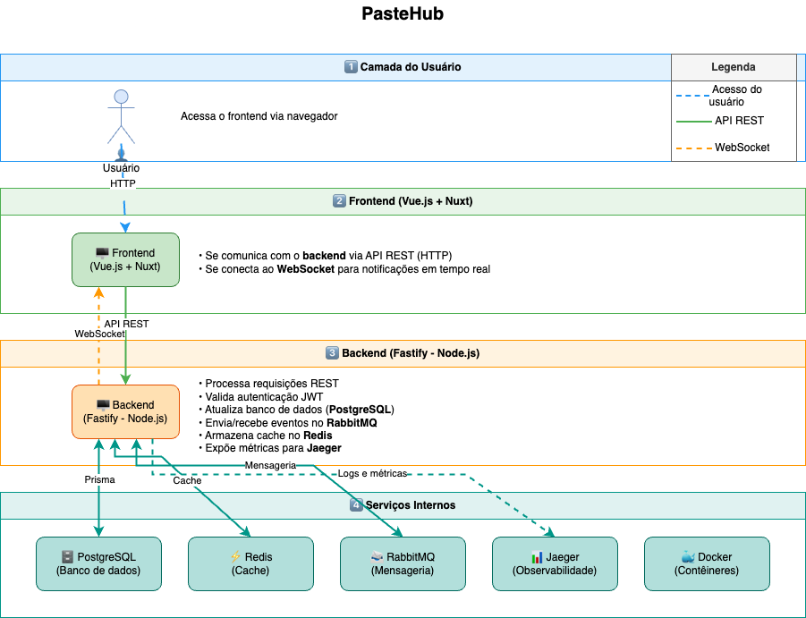
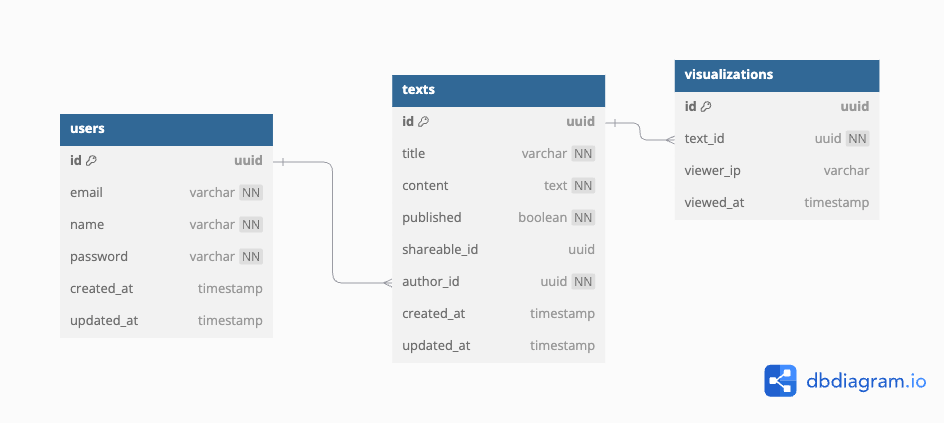

# 📌 PasteHub

PasteHub é uma aplicação fullstack para criação, edição e compartilhamento de textos. Desenvolvido com tecnologias modernas, o projeto oferece uma experiência completa de gerenciamento de conteúdo textual com desempenho otimizado.

## 🚀 Tecnologias Utilizadas

- **Frontend**: Vue.js + Nuxt
- **Backend**: Fastify + Node.js
- **Banco de Dados**: PostgreSQL + Prisma ORM
- **Cache**: Redis
- **Mensageria**: RabbitMQ
- **Observabilidade**: Jaeger
- **Containerização**: Docker + Docker Compose

## 📂 Estrutura do Projeto

```plaintext
pastehub/
│── backend/         # Código-fonte do backend (Fastify, Node.js, Prisma)
│── frontend/        # Código-fonte do frontend (Vue.js, Nuxt)
│── README.md        # Documentação do projeto
```

## ⚡ Como Rodar o Projeto

### 🔧 Configuração Manual (Desenvolvimento)

1. Clone o repositório:

   ```bash
   git clone https://github.com/pedroirm/pastehub.git
   cd pastehub
   ```

2. Rodando o Backend:

   ```bash
   cd backend
   docker-compose up -d
   npm install
   cp .env.example .env
   npx prisma generate
   npx prisma migrate dev --name init
   npm run dev
   ```

3. Rodando o Frontend:

   ```bash
   cd frontend/
   npm install
   npm run dev
   ```

4. Acesse:
   - **Frontend**: http://localhost:3001
   - **Backend**: http://localhost:3000

## 📚 Documentação da API

Acesse a documentação Swagger:

- http://localhost:3000/documentation

## 🏗️ Diagrama da Arquitetura

A arquitetura do PasteHub é baseada em microserviços com comunicação assíncrona via RabbitMQ. O sistema utiliza Redis para cache, melhorando o desempenho de operações frequentes, e Jaeger para monitoramento distribuído.



### Componentes Principais:

- **API Gateway**: Gerencia autenticação e roteamento
- **Serviço de Pastes**: Manipula operações CRUD dos textos
- **Serviço de Usuários**: Gerencia autenticação e perfis
- **Worker de Processamento**: Realiza operações assíncronas em background

## 📊 Modelo de Dados (ERD)

O modelo de dados do PasteHub é centrado em três entidades principais: Usuários, Pastes e Categorias.



### Entidades Principais:

- **User**: Armazena informações dos usuários registrados
- **Paste**: Contém os textos criados, com informações de autoria e configurações
- **Category**: Permite organização dos pastes em grupos temáticos

## 📝 Licença

Este projeto está licenciado sob a [Licença MIT](LICENSE).
